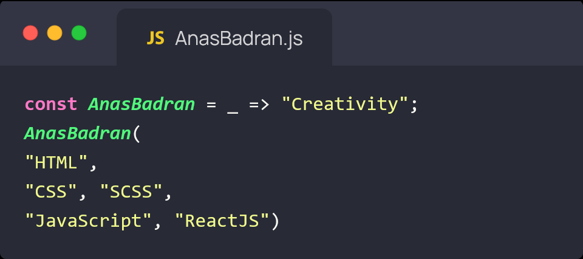
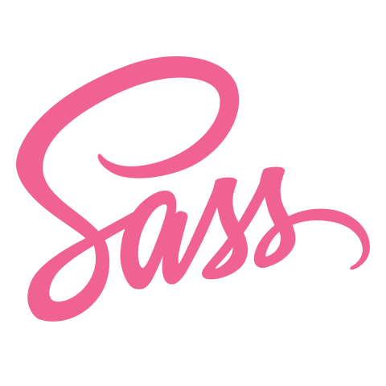
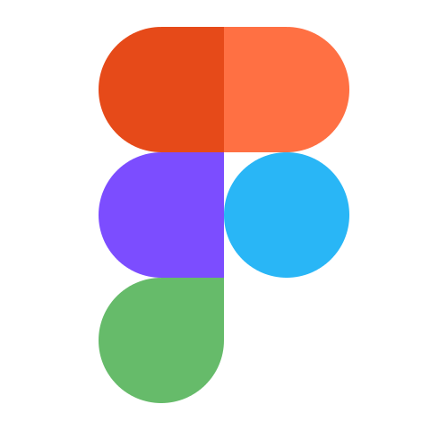

<h1 align="center">Hi, I'm Anas Badran 👋</h1>

<!--[](https://git.io/typing-svg)-->

<!--<h3 align="center"> I love learning new things, and I love what I do even more, constantly improving my skills and my knowledge</h3>-->

<!--<p align="center">-->

<!---->

<!--</p>-->
<!-- 
 ```javascript
const anas = (() => "creativity")()
``` -->

> ## Main Skills:


> ## Skills I have, and tools I use:

 60 WPM" src="./imgs/sub/typing.png" alt="Fast typing: > 60WPM" width="73">

> ## What I'm currently learning:

          

> ## other skills I have:

- Video Editing.
- Captions & Subtitles
- Translation
- Intermediate Excel user
