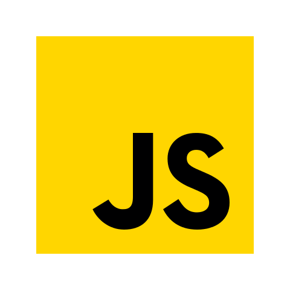
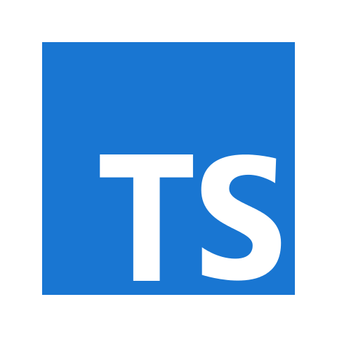

<h1 align="center">Hi, I'm Anas Badran 👋</h1>

<!--<h2 align="center"><u>Self-taught</u> Front-end Developer</h2>-->

<!--<h3 align="center"> I love learning new things, and I love what I do even more, constantly improving my skills and my knowledge</h3>-->

> ## Main Skills:

> ## Skills I have, and tools I use:

> ## What I'm currently learning:

        

> ## other skills I have:

- Video Editing.
- Captions & Subtitles
- Translation
- Intermediate Excel user
